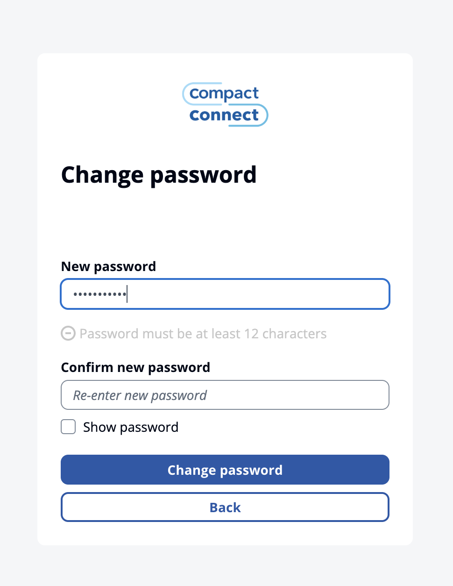
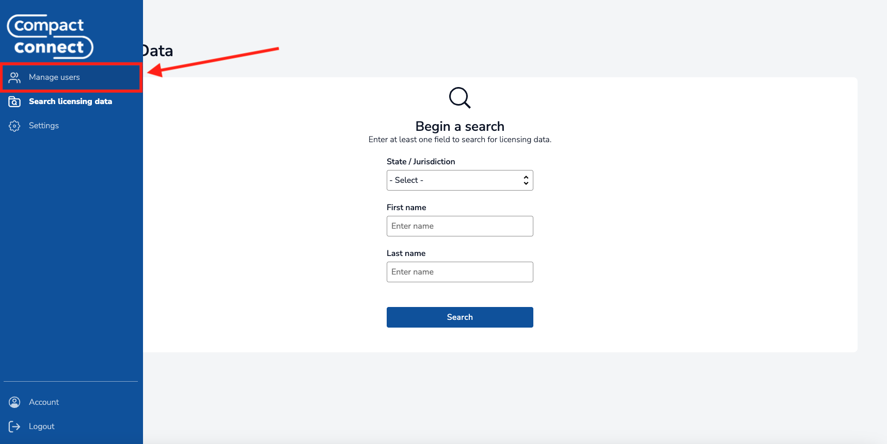
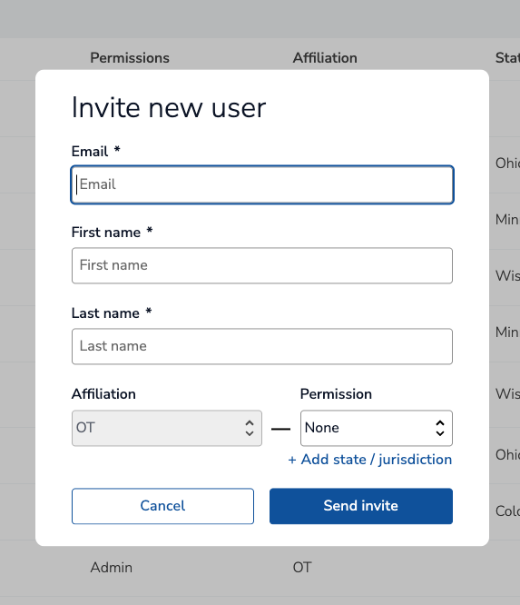
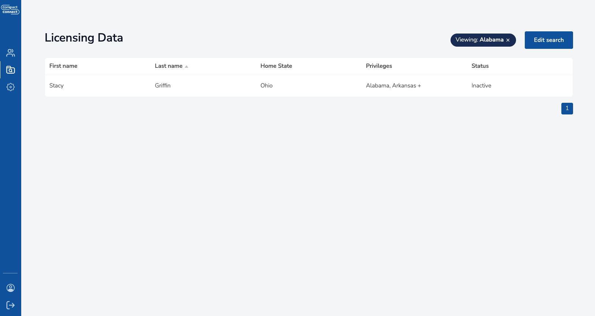

# Compact Connect: Administrative Staff Onboarding Guide

This guide provides step-by-step instructions for Compact and State administrative staff to onboard into the Compact Connect Production and Beta environments.

## Table of Contents
- [Initial Setup and Login](#initial-setup-and-login)
- [User Management](#user-management)
- [System Configuration](#system-configuration)
- [General User Functions](#general-user-functions)
- [Data Upload](#data-upload)
- [Privilege and License Management](#privilege-and-license-management)

---

## Initial Setup and Login

### First-Time Access
The Compact Connect team will configure the initial Compact Staff user account. You will receive an invitation email at the address provided to the team containing:
- Your username
- A temporary password
- Login instructions

### Logging In
1. Navigate to the main Compact Connect dashboard
2. Select **"Login as Compact or State Staff"**
3. Enter your login credentials using the temporary password provided
4. You will be prompted to create a permanent password upon first login

---

## User Management

Once logged in, administrators can manage staff users through the user management interface.

### Accessing User Management
Navigate to **"Manage Users"** in the left navigation panel to access user management functions.

### Inviting New Staff Users

#### Steps to Invite Users:
1. Click the **"Invite"** button in the top-right corner of the User Management page
2. Complete the invitation form with the following information:
   - User's email address
   - First and last name
   - Compact or State affiliation
   - Required permissions (see [Permissions](#permissions) section below)
3. Click **"Send Invite"** to dispatch the email invitation

### Permissions

The Compact Connect system uses role-based permissions that can be granted at either the compact or state level:

#### Available Permissions:

**Read Private**
- Access to non-public practitioner information (e.g., date of birth)
- Should only be granted when necessary for job responsibilities

**Read SSN**
- Access to full Social Security Numbers of practitioners
- ⚠️ **Critical**: This permission should only be granted when absolutely required for job responsibilities

**Admin**
- Manage other users within their respective Compact or State scope
- Define privilege fee rates
- Configure system notification recipients
- **Compact Admins**: Can deactivate privileges
- **State Admins**: Can set encumbrances on licenses and privileges
- Includes both Read Private and Read SSN permissions

**Write** *(State-level only)*
- Upload licensure data for a specific state

### Managing Existing Users

#### Resending Invitations
If a user hasn't logged in within seven days or didn't receive their initial invitation:

1. Locate the user in the User Management list
2. Click the three-dot menu (⋮) next to their name
3. Select **"Resend Invite"**

#### Editing User Permissions
To modify a user's permissions:

1. Click the three-dot menu (⋮) next to the user's name
2. Select **"Edit Permissions"**
3. Adjust the permission settings as needed
4. Click **"Save Changes"**

⚠️ **Important**: Users currently logged into the system must log out and log back in for permission changes to take effect.

#### Deactivating Users
When a staff member leaves their position:

1. Click the three-dot menu (⋮) next to their name
2. Select **"Deactivate"**
3. Confirm the deactivation

---

## System Configuration

### Compact and State Settings
Administrators can configure system settings through the **"Settings"** page in the navigation menu.

*Note: Detailed configuration instructions will be added in a future update.*

## General User Functions

### Searching License Data

#### Accessing the Search Function
Select **"Search Licensing Data"** from the left navigation panel.

#### Search Criteria
You can search using the following parameters:
- **State/Jurisdiction**: Select from dropdown menu. This will filter the results to only display practitioners that have a license or privilege in the specified jurisdiction.
- **Practitioner Name**: Enter full first and last name
- **Combined Search**: Use both state and name criteria

⚠️ **Note**: Partial name searches are not currently supported. You must enter the complete first and last name.

#### Performing a Search
1. Enter your search criteria
2. Click **"Search"**
3. Review results on the License Listing page
4. Click any row to view detailed practitioner information

### Practitioner Details Page

The practitioner details page displays comprehensive license and privilege information for individual practitioners.

#### Available Information:
- Licenses and their current status
- Privileges and their current statis
- Privilege history and timeline

#### Viewing Privilege History
Click **"View Details"** on any privilege card to access:
- Complete privilege timeline, including status changes such as deactivation and encumbrance.
- Status change history

---

## Data Upload

### License Information Upload
**This feature is available to staff users with write permissions only.**

#### Uploading License Data
1. Select **"Upload Data"** from the left navigation panel
2. Click **"Choose File"** to select your CSV document
3. Ensure your CSV file follows the required data schema, see 
4. Click **"Submit"** to process the upload

#### CSV File Requirements
Your CSV file must include all required license data fields as specified in the [License Data Schema Documentation](../backend/compact-connect/docs/README.md).

#### Upload Validation
The system will validate your data and provide weekly email feedback on:
- Successful imports
- Data formatting errors
- Missing required fields

These email notifications will be sent to whichever email addresses have been set by the state admin for your respective state's Operations notification recipients.

---

## Privilege and License Management

### Deactivating Privileges
**This feature is available to Compact Administrators only.**

#### Steps to Deactivate a Privilege:
1. Navigate to the practitioner's detail page (see [Practitioner Details](#practitioner-details-page))
2. Locate the privilege requiring deactivation
3. Click the three-dot menu (⋮) in the top-right corner of the privilege card

4. Select **"Deactivate"**
5. Complete the notes section explaining the reason for deactivation
6. Click **"Deactivate Privilege"**

⚠️ **Important**: Deactivating privileges is different from encumbering them due to adverse actions. Encumbrance procedures are described below.

### Encumbering Privileges and Licenses
**This feature is available to State Administrators only.**

#### Steps to Add an Encumbrance:
1. Navigate to the practitioner's detail page(see [Practitioner Details](#practitioner-details-page))
2. Locate the privilege or license requiring encumbrance
3. Click the three-dot menu (⋮) in the top-right corner of the card

4. Select **"Encumber"**
5. Complete the encumbrance form with required information
6. Click **"Encumber Privilege"** or **"Encumber License"**

#### Removing Encumbrances
To remove an existing encumbrance:
1. Navigate to the practitioner's detail page
2. Locate the encumbered privilege or license
3. Click the three-dot menu (⋮) in the top-right corner of the card
4. Select **"Remove Encumbrance"**
5. Complete the removal form
6. Click **"Confirm Removal"**

*Screenshot placeholder: Encumbrance form*

---

## Support and Contact Information

For technical support or questions about the onboarding process, please contact the Compact Connect team at [support-email].

---

